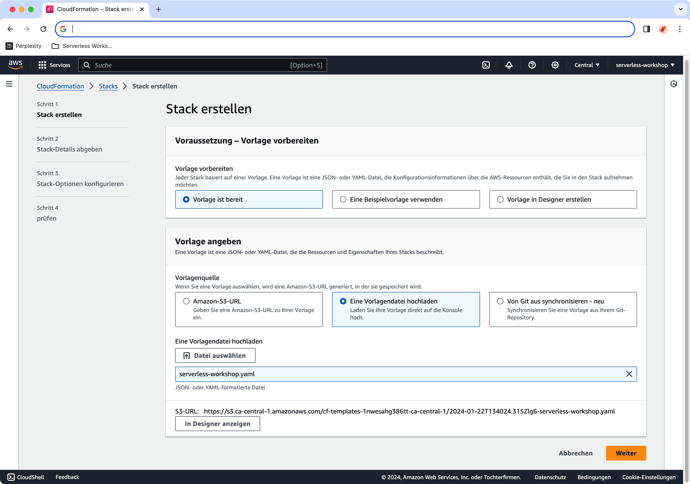
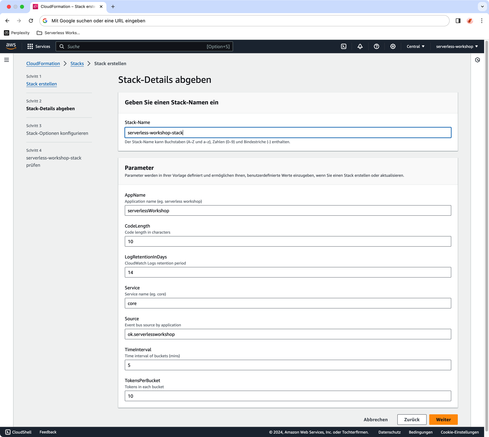
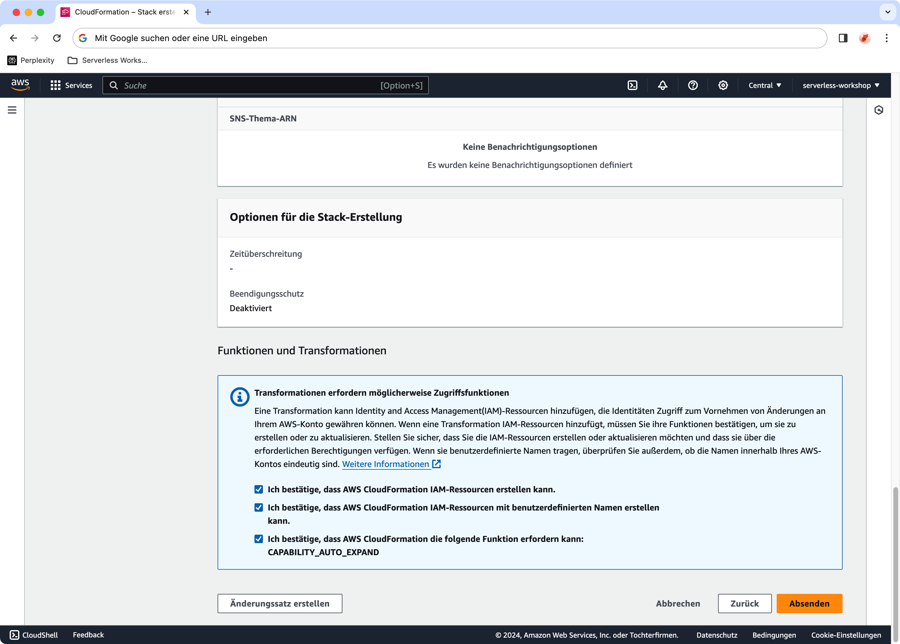
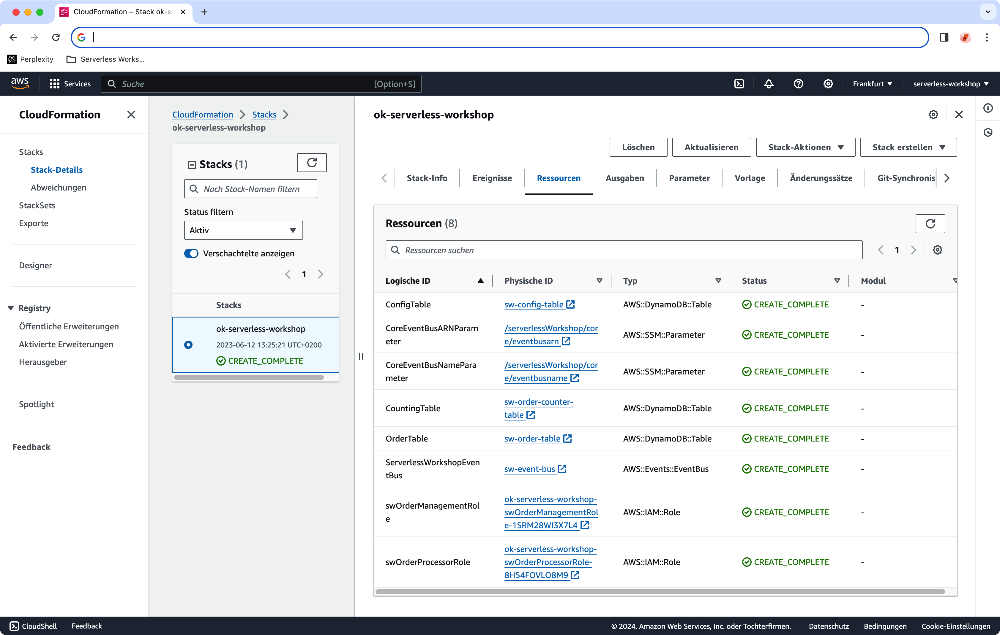

# Serverless Workshop

## Übung 0: Setup
Bevor wir mit dem Serverless-Workshop und den Workshop-Übungen beginnen, gilt 
es zunächst unser Cloud-Environment vorzubereiten. 

Zu diesem Zweck erstellen wir mithilfe eines [CloudFormation](https://aws.amazon.com/de/cloudformation/)-Templates gemeinsam die für unseren Workshop notwendigen Cloud-Komponenten. 

> **Infrastructure as Code**: Für das Anlegen der gewünschten Cloud-Komponenten nutzen wir ein "Zielbild", welches in einem IaC Template hinterlegt ist. 

### Schritt 1: Anmelden an der AWS Konsole
Melde dich mit deinen AWS-Credentials an der [AWS-Konsole](https://signin.aws.amazon.com/signin) an. 

> **Best Practices**: Nutze aus Gründen der Sicherheit zum Anmelden bei AWS einen IAM-Benutzer mit eingeschränkten Zugriffsrechten und nicht den Stammbenutzer. Der Stammbenutzer hat unbegrenzten Zugriff auf den Account.    

### Schritt 2: CloudFormation-Template einspielen

Gehe zum AWS-Service [CloudFormation](https://console.aws.amazon.com/cloudformation/) in der von dir 
ausgewählten Region (z.B. eu-central-1 aka Frankfurt).

Zum Einspielen des CloudFormation-Templates des Serverless-Workshops gehe auf **Stack erstellen** und 
wähle dort den Standard **Mit neuen Ressourcen** aus:  

* _Stack erstellen_ > _Mit neuen Ressourcen (Standard)_

Im Dialog-Fenster **Stack erstellen** wähle unter ... aus:  

* "Voraussetzung – Vorlage vorbereiten" > _Vorlage ist bereit_
* "Vorlage angeben" > _Eine Vorlagedatei hochladen_
* "Datei auswählen" > _00___setup/infrastructureAsCode/serverless-workshop.yaml_
* _weiter_

Abbildung 01: *CloudFormation Stack aus Vorlage erstellen*

Im nachfolgenden Dialog-Fenster **Stack-Details abgeben** gilt es dem Stack einen eindeutigen Namen zu geben, sowie weitere Details zu dem Stack einzugeben. Die Details werden automatisch aus dem Template gezogen und mit ggf. bereits hinterlegten Default-Werten vorausgefüllt. 

In unserem Beispiel gibt es bereits für alle Parameter einen sinnvollen Default-Wert, so dass lediglich der individuelle Stack-Name eingegeben werden muss: 

* "_Stack-Name_" > _MEIN STACK NAME_
* _weiter_

Abbildung 02: * CloudFormation Stack Details angeben*

Im Dialog-Fenster **Stack-Optionen konfigurieren** gibt es in unserem Beispiel keine Einstellungen vorzunehmen, so dass wir direkt zum nächsten Dialog springen können. Dazu einfach nur ... auswählen: 

* _weiter_

Mit Hilfe des letzten Dialog-Fensters **MEIN STACK NAME prüfen** geben wir CloudFormation die Berechtigungen zum Erstellen der im Template angegeben Ressourcen: 

* _Berechtigungen für erforderliche Transformationen auswählen_
* _Absenden_

Abbildung 03: * CloudFormation Stack Details angeben*

Im Anschluss werden die für den Serverless-Workshop notwendigen Ressourcen erstellt.
 
> **Achtung**: Das Erstellen der Ressourcen kann eine kurze Weile dauern. 

Im Anschluss sollte es drei DynamoDB Tabellen 

- sw-config-table
- sw-order-table
- sw-order-counter table

einen EventBridge Service Bus

- sw-service-bus

sowie zwei Berechtigungsrollen 

- ok-serverless-workshop-swOrderManagementRole
- ok-serverless-workshop-swOrderProcessorRole 

geben. 

Abbildung 04: **CloudFormation Stack Resultat**

### Schritt 3: Tabellen initial füllen 

Mithilfe von CloudFormation lassen sich zwar die benötigten Ressourcen erstellen, deren anschließende Initialisierung - falls notwendig - ist aber mittels CloudFormation alles andere als trivial. 

Der Einfachheit halber fügen wir daher die wenigen notwendigen Werte für die beiden Tabellen 

	sw-config-table
	sw-order-counter-table

per Hand ein. 

Die zugehörigen Daten finden sich im Verzeichnis 

	00_setup/initialization
	
in den Dateien 

	sw-config-table.csv
	sw-order-counter-table.csv

Alle dazu notwendigen Schritte gehen wir gemeinsam durch. 

Anmerkung
> Die DynamoDB Tabellen könnten auch via SDK API oder durch einen S3 Import initial gefüllt werden. 

### Diskutierenswert ... 

Frage an dich selbst: 
> Welchen Vorteil hat das Nutzen eines Infrastructure as Code Templates zum Anlegen der gewünschten Cloud-Komponenten. 
 
Frage an dich selbst:
> Sind mit der Verwendung von IaC im Allgemeinen und CloudFormation im Speziellen auch Nachteile verbunden?

