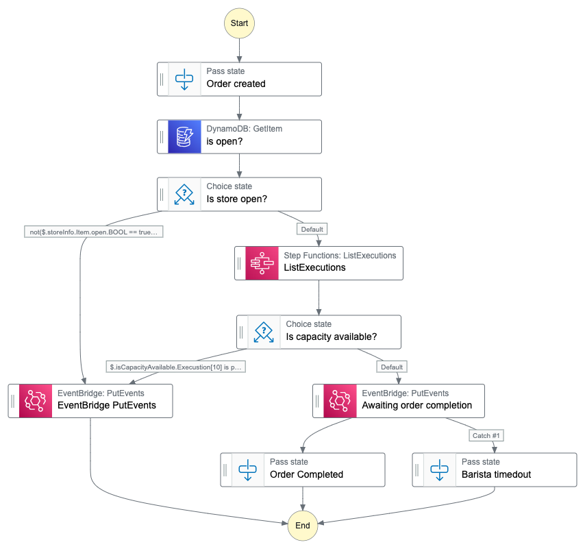
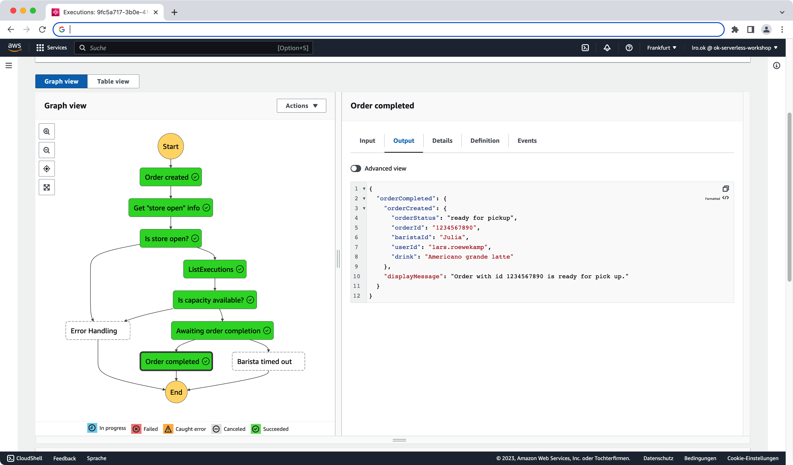
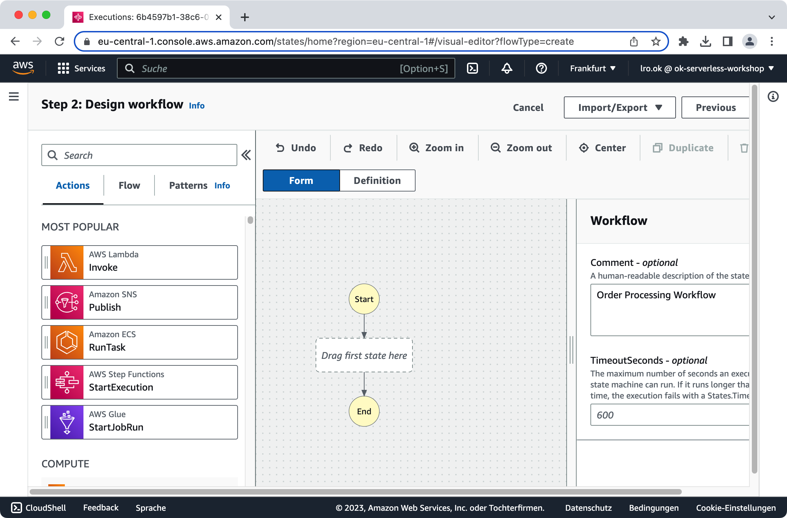
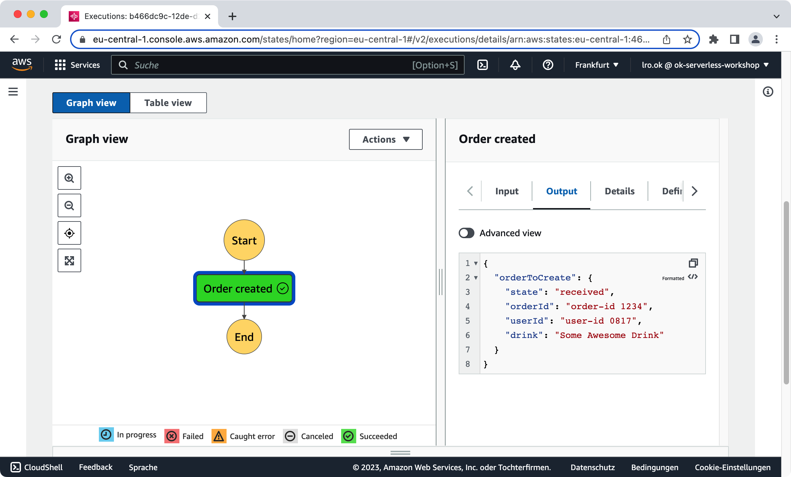
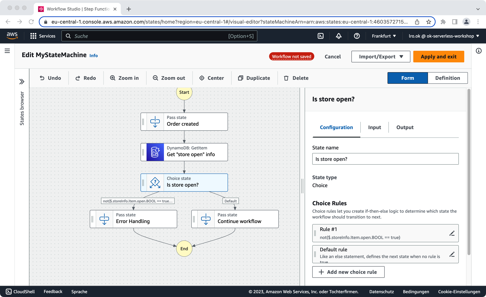
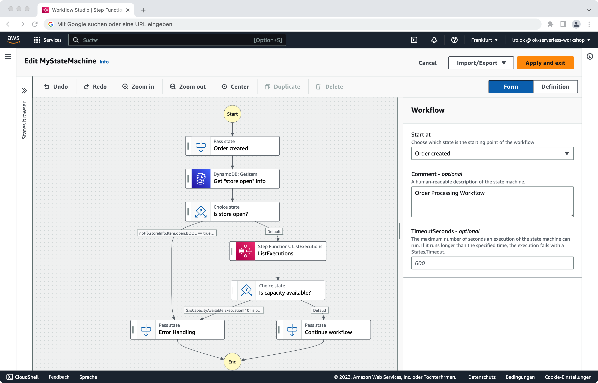
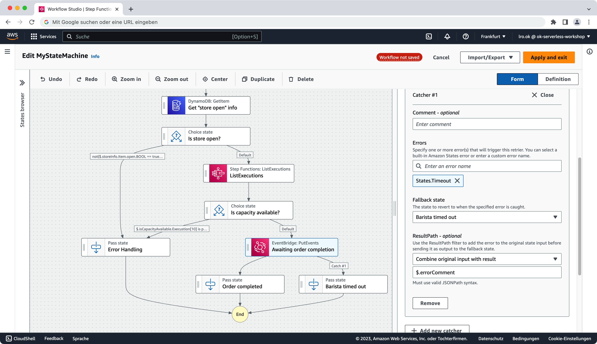
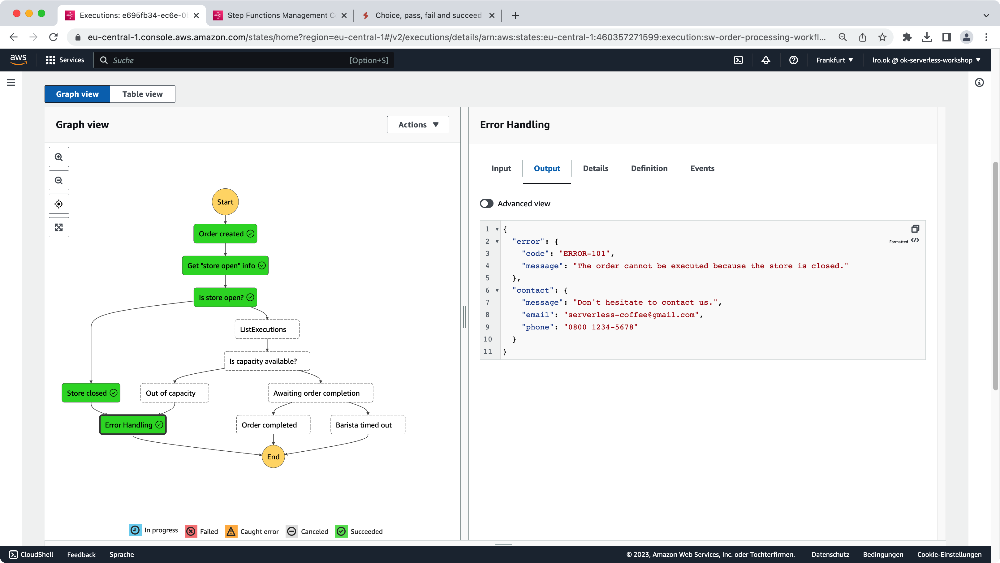

# Serverless Workshop

## Übung 3: Serverless Workflow

Im bisherigen Verlauf des Workshops haben wir uns aus fachlicher Sicht hauptsächlich mit dem Aufgeben einer Kaffeeestellung durch den Kunden beschäftigt.  

Wir haben in dem Zuge verschiedene Beste Practices für Serverless Functions und deren Zusammenspiel mit anderen Cloud-Komponenten kennengerlern. 

In dieser Übung wollen wir uns nun Serverless Workflows - aka [Step Functions](https://docs.aws.amazon.com/step-functions/latest/dg/welcome.html) - anschauen. Step Functions bieten, anders als Serverless Functions, die Möglichkeit, langlaufende Prozesse abzubilden. 

Kosten fallen dabei nicht, wie von den Serverless Functions gewohnt, für die Dauer des Prozesses an, sondern lediglich für die Anzahl der Prozessschritte bzw. deren Übergänge. Das macht State Functions durchaus auch für Szenarien interessant, in denen man normalerweise an eine Realisierung via Serverless Functions denken würde. 


Ziel dieser Übung ist es, ...
> den Prozess der Order-Verarbeitung durch die/den Barista abzubilden. 
 
Da ein Bild mehr sagt als tausend Worte, hier eine Abbildung des fertigen Prozess-Flows: 


Abbildung 01: *Order Processing Workflow*

### Den Workflow verstehen ;-) 

Bevor wir mit der Umsetzung loslegen, wollen wir uns kurz den Order Processing Workflow aus fachlicher Sicht anschauen: 

Angestoßen wird der Workflow durch eine eingehende Order. 

> *Reminder*: Wir erinnern uns, dass die Serverless Functions aus Übung 02 Domänen-Events (OrderCreated, OrderDeleted, ...) erzeugt haben. Diese werden wir verwenden, um unseren Workflow zu starten. Dazu später mehr. 

Bevor wir mit der Abarbeitung der eingehenden Order beginnen, also bevor die/der Barista startet die Bestellung zuzubereiten, schauen wir zunächst, ob ...

* der Store geöffnet hat: "Is store open?"
* die/der Barista frei ist: "Is capacity available?"

Wenn ja, kann mit der Abarbeitung der Oder begonnen werden. An dieser Stelle, pausieren wir den Order Processing Workflow solange, bis uns die/der Barista signalisiert, dass ...

* die Bestellung fertig ist: "Awaiting order completiion"

Ist dies der Fall, wird unser Order Processing Workflow erfolgreich beendet und eine entsprechende Ausgabe erzeugt. Abbildung 02 zeigt eine erfolgreich abgearbeitete Bestellung inkl. Ausgabe: 


Abbildung 02: *Successful Order Processing*

### Schritt 0: Leeren Order Process Workflow erstellen

Wir starten zunächst einmal mit einem leeren Workflow. Dazu wählen wir den AWS Service "Step Functions" aus und dort die Funktion "Create State Machine". 

	Step Functions > Create state machine
	
Im Anschluss einfach 

* Design your workflow visually 
* Type: Standard 

auswählen und los geht's. Das Ergebnis ist ein leerer Workflow, auf dem wir in den folgenden Schritten aufsetzen werden (siehe Abbildung 03). 


Abbildung 03: *Leerer Order Processing Workflow*


### Schritt 1: "Trigger Workflow"

Zunächst einmal gilt es den Einstiegspunkt für den Prozess festzulegen. Dazu ziehen wir ein Flow-Element vom Typ _Pass_ Typ in unseren Workflow. 

* Flow: Pass

Angetriggert wird unser Workflow durch ein OrderCreated Event des AWS Event-Handler Services EventBridge. Die für uns relevante Information über die eigentliche Bestellung findet sich innerhalb der Event-Payload in einem JSON-Element namens "detail": 

```
{
  ... 
  "detail": {
    "orderId": "1234",
    "userId": "lars.roewekamp",
    "drink": "Some Awesome Drink"
  }
  ...
}
```

> **TIPP**: Wenn dich der konkrete Aufbau eines EventBridge Events interessiert, dann auch dir die entsprechende [Dokumentation](https://docs.aws.amazon.com/eventbridge/latest/userguide/eb-events-structure.html) an. 

Dieses gilt es herauszufiltern und dem Prozess zur Verfügung zu stellen. Dazu ist im Tab "Input" des Pass-Elements folgende Einstellung notwendig: 

* Transform input with Parameters
* Input: 

```
{
  "orderToCreate": {
    "state": "received",
    "orderId.$": "$.detail.orderId",
    "userId.$": "$.detail.userId",
    "drink.$": "$.detail.drink"
  }
  "displayMessage.$": "States.Format('Order with id {} entered workflow.',$.detail.orderId)",

}
```

> **ASL Mapping**: Das obige Mapping nutzt die Möglichkeit, Variablen via JSON-Paths Syntax zu setzen. Darüber hinaus wird auf eine [Intrinsic Function](https://docs.aws.amazon.com/step-functions/latest/dg/amazon-states-language-intrinsic-functions.html) namens States.format(...) zugegriffen. 

Im Anschluss einfach auf "Next" klicken, um so in den nächsten Schritt (Step 3: Review generated code) des Step Function Wizared zu gelangen. Auf der dann erscheinenden Seite erneut 

* Next 

klicken, um so auf die Seite zur Konfiguration der Step Function zu gelangen (Step 4: Specifiy state machine settings). 

Im Rahmen der Konfiguration gilt es eine IAM Rolle für den Prozess anzugeben, welche alle dafür notwendigen Berechtigungen für die innerhalb des Workflows auszuübenden Operationen besitzt. Greift der Workflow, wie in unserem Falle auf eine DynamoDB oder den Event Handler zu, muss die Rolle entsprechende Rechte zum lesenden und/oder schreibenden Zugriff auf diese Cloud-Komponenten besitzen. Zum Glück haben wie genau eine solche Rolle bei unserem initialen Setup bereits mit angelegt: 

* Permissions
	* Choose an existing role
		* 	...-swOrderProcessorRole-...
* Next 

#### Testing "Trigger Workflow"

Unsere StepFunction ist nun angelegt und kann getestet werden. Einfach auf 

* Start execution 

klicken und im PupUp-Fenster unter Input den Eingang einer Bestellung simulieren: 

```
{
  "detail": {
    "orderId": "1234567890",
    "userId": "lars.roewekamp",
    "drink": "Americano grande latte"
  }
}
```

Das Ergebniss sollte ähnlich wie in Abbildung 04 aussehen: 


Abbildung 04: *Minimaler Workflow mit Trigger*

### Schritt 2: "Is store open?"

Im nächsten Schritt wollen wir nun schauen, ob der Store überhaupt geöffnet hat und wir die Bestellung verarbeiten können. Die dazu notwendigen Informationen finden sich in der DynamoDB Tabelle namens _sw-config-table_ unter dem Partition Key _config_.

> Prüfe zunächst, ob der Eintrag in der entsprechenden Tabelle vorhanden ist. Wenn nicht, lege einen entsprechenden Eintrag mit folgenden Attributen (PK vom Typ String = config, open vom Typ Boolean = true).  

Zur Implementierung von "Is store open" benötigen wir zwei neue Workflow-Elemente. Zum einen ein Element zum Auslesen der notwendigen Information aus der DynamoDB Tabelle (Item mit PK == config) und zum anderen ein Element zur Auswertung der Information (open == true?): 

1. Actions > DynamoDB: GetItem
2. Flow > Choice 

Platziere beide Elemente in der angegebenen Reihenfolge in unserem Workflow.

#### "open"-Info aus DynamoDB auslesen

In dem ersten Element - DynamoDB: GetItem - gilt es via API Parameter den direkten Zugriff auf die DB zu realisieren und das Ergebnis dem folgenden Schritt (Flow: Choice) zur Verfügung zu stellen. 

Dazu tragen wir zunächst im Tab _Configuration_ des Get-Item Elements im Feld _API Parameters_ folgende DynamoDB-Abfrage ein, desssen Ergebnis die die DB-Zeile mit der Konfiguration ist: 

```
{
  "TableName": "sw-config-table",
  "Key": {
    "PK": {
      "S": "config"
    }
  }
}
```

Im Anschluss sorgen wir im Tab _Output_ dafür, dass die Daten an den nächsten Workflow-Schritt als JSON-Element _storeInfo_ weitergeleitet werden: 

* Add original input to output using ResultPath
	* Combine original input with result
		* $.storeInfo

#### "open"-Info auswerten

Zur Entscheidung, ob der Store geöffnet ist oder nicht, springen wir nun in das Choice-Element. 

Dort gilt es zunächst in dem Tab _Configuration_ eine Entscheidungsregel (Choice Rule) zu definieren, anhand derer der weitere Verlauf des Workflows entschieden wird: 

* Choice Rules im Tab Configuration
	* Rul#1: edit wählen 
		* 	Add conditions
			*  Not: NOT
			*  Variable: $.storeInfo.Item.open.BOOL
			*  Operator: is equal to
			*  Value: Boolean constant == true 
*  Save conditions

Als Resultat sollte nun folgender Ausdruck unter Rule #1 abgebildet werden:

	not($.storeInfo.Item.open.BOOL == true) 

> **Hinweis**: Die Regel wertet aus, ob der Shop geschlossen ist! Wenn ja, wird in einen Fehlerzweig gesprungen. Wenn nein, geht es mit dem eigentlichen Workflow weiter (siehe Schritt 3). 

Damit die Choice-Regeln nicht ins Leere laufen, platzieren wir vorübergehend Pass-Elemente als Folgeschritte.  

Abbildung 05 zeigt den aktuellen Stand unseres Order Processing Workflows: 


Abbildung 05: *Choice: Is store open?*

#### Testing "Is store open?"

Zum Testen des neuen Schritts können wir wieder die obige Eingabe verwenden: 

```
{
  "detail": {
    "orderId": "1234567890",
    "userId": "lars.roewekamp",
    "drink": "Americano grande latte"
  }
}
```

### Schritt 3: "Is capacity available?"

Als Nächstes gilt es zu klären, ob noch ausreichend Barista-Kapazitäten vorhanden sind. 

> Wir gehen in unserem Szenario davon aus, dass bis zu 10 Kaffee parallel in Bearbeitung sein dürfen. 

Um diese Frage zu klären, greifen wir auf einen kleinen Trick zurück und zählen die aktuell laufenden Order Processing Workflow-Instanzen, um im Anschluss auf Basis des Ergebnisses zu entscheiden, ob noch hinreichend Kapazitäten vorhanden sind oder nicht. Die dafür benötigten Workflow-Elemente sind: 

1. Actions > StepFunctions: ListExecutions
2. Flow > Choice 

> **Hinweis**: Für diesen Schritt benötigen wir den ARN (Amazon Resource Name) unseres Step Function Workflows. Dieser findet sich auf der zugehörigen Übersichtsseite. 

#### Aktuelle Kapazität ermitteln

Zum Ermitteln der aktuellen Kapazität zählen wir die aktuell laufenden Instanzen unseres Workflows. Dies können wir mit Hilfe des Workflow-Elements 

*  StepFunctions: ListExecutions

und der folgenden Einstellung im Tab _Configuration_ im Feld _API Parameters_ erreichen: 

```
{
  "StateMachineArn": "[MY_ARN_GOES_HERE]",
  "MaxResults": 100,
  "StatusFilter": "RUNNING"
} 
```

Damit die ermittelte Information auch an den nächsten Schritt weiter gereicht wird, gilt es die Ausgabe im Tab _Output_ entsprechend anzureichern: 

* Add original input to output using ResultPath
	* Combine original input with result
		* $.isCapacityAvailable

Diese Anweisung erzeugt ein neues JSON-Element namens _isCapacityAvailable_ im Output auf das wir in dem folgenden Choice-Element zugreifen können. 

#### Aktuelle Kapazität auswerten

Der Folgeschritt ist, wie bereits erwähnt, ein Choice-Element, für das wir folgende Konfiguration vornehmen: 

* Choice Rules im Tab Configuration
	* Rul#1: edit wählen 
		* 	Add conditions
			*  Not: blank lassen 
			*  Variable: $.isCapacityAvailable.Execution[10]
			*  Operator: is present
*  Save conditions

Im Anschluss sollte unter Rule #1 folgender Ausdruck abgebildet sein: 

	$.isCapacityAvailable.Execution[10] is present
	
Der Ausdruck schaut nach, ob es einen 10ten Order Processing Workflow gibt. Wenn ja, dann ist die maximale Kapazität ausgeschöpft. 

Als Folge-State für diese Regel wählen wir den bereits vorhandenen Platzhalter-State _Error Handling_. 	

> **Hinweis**: Die Regel wertet aus, ob die/der Barista bereits voll ausgelastet ist. Wenn ja, wird in einen Fehlerzweig gesprungen. Wenn nein, geht es mit dem eigentlichen Workflow weiter (siehe Schritt 4). 

Abbildung 06 zeigt den aktuellen Stand unseres Order Processing Workflows: 


Abbildung 06: *Choice: Is capacity available?*

#### Testing "Is capacity available?"

Getestet wird der neue Schritt, wie gewohnt, mit der Eingabe: 

```
{
  "detail": {
    "orderId": "1234567890",
    "userId": "lars.roewekamp",
    "drink": "Americano grande latte"
  }
}
```

### Schritt 4: "Awaiting order completion"

Kommen wir nun endlich zur Abarbeitung der Bestellung durch die/den Barista. An dieser Stelle kommt zum ersten Mal unser Event Handler EventBridge ins Spiel. 

Zunächst einmal senden wir aus dem Workflow heraus ein Event an den Event Handler, welches siganlisiert, dass mit der Bearbeitung der Bestellung begonnen wurde. Auf dieses Event könnte z.B. die Bestell-Anwendung des Kunden "hören" und sich die Statusanzeige innerhalb der UI entsprechend ändern. 

Der Trick ist nun, dass wir den Workflow an dieser Stelle so lange anhalten, bis die/der Barista die Fertigstellung der Bestellung signalisiert. Aber immer schön der Reihe nach ... 

#### Put Event: "Bestellung in Bearbeitung"

Als erstes fügen wir als neuen Folgeschritt für den Default-Zweig unseres Choice-Elements "Is capacitiy available?" ein Element vom Typ 

* EventBridge: PutEvents 

ein. Dass die für diese Aktion - EventBridge: PutEvent - notwendigen Berechitgungen vorhanden sind, haben wir bereits initial durch Auswahl der IAM Rolle sichergestellt. 

Im Tab _Configuration_ tragen wir im Feld _API Parameters_ folgendes JSON-Template ein, welches zur Laufzeit die Payload das zu versendende Event erzeugt:


```
{
  "Entries": [
    {
      "Detail": {
        "Message": "Thank you for 'submitting an order'. The workflow resumes as soon as a barista finish your drink.",
        "TaskToken.$": "$$.Task.Token",
        "orderId.$": "$.orderToCreate.orderId",
        "userId.$": "$.orderToCreate.userId",
        "drink.$": "$.orderToCreate.drink"
      },
      "DetailType": "OrderProcessor.WaitingCompletion",
      "EventBusName": "sw-event-bus",
      "Source": "ok.serverlessworkshop"
    }
  ]
}
```

> Tipp: schaue dir den Inhalt der Event-Konfiguration etwas genauer an und versuche zu verstehen, wofür die einzelnen Elemente gedacht sind. 

Zusätzlich haken wir das Kästchen bei 

* Wait for Callback 

an, was dafür sorgt, dass unser Workflow an dieser Stelle so lange pausiert, bis eine Eingabe von Aussen erfolgt. 

Neben einer Nachricht und Informationen zur Bestellung selbst (orderId, userId und drink), beinhaltet das Event noch drei Elemente, die zur Zuordnung des Event-Types und der zu nutzenden Event-Bus dienen 

* DetailType
* EventBusName
* Source

sowie ein 

* TaskToken

mit dessen Hilfe die versendende Workflow-Instanz und der damit verbundene Workflow-Schritt eindeutig identifiziert werden kann.

#### Put Event: "Bestellung in Bearbeitung | Timeout"

Da wir nicht unendlich darauf warten wollen, dass die/der Barista die Fertigstellung der Bestellung meldet, benötigen wir noch eine Option zum automatischen Abbruch via Timeout nach 15 Minuten. Dies erreichen wir über die Angabe eines Ausnahmebehandlung im Tab _Error Handling_: 

* Catch errors
	* Add new Catcher 
		* Comment: Barista timed out
		* Errors: States.TimedOut
		* Fallback State: Add new State > Flow: Pass > "Barista timed out"
		* ResultPath: Combine original input with result > $.errorComment
	* Heartbeat: 900 seconds 

#### Put Event: "Bestellung in Bearbeitung | Output"

Nachdem wir den negativen Fall - Timed out - betrachtet haben, müssen wir uns auch Gedanken darüber machen, welche Payload wir im Falle eines positiven Verlaufs an den nächsten Schritt weiterleiten wollen. 

Der Callback erfolgt durch den/die bearbeitende Barista. Es wäre also schön, wenn wir unsere bestehende Payload genau um diese Information anreichern können. Schließlich möchte man doch wissen, bei wem man sich am Ende für den leckeren Kaffee bedanken darf. 

Das Anreichern der Payload für den Folgeschrit geschieht nach gewohntem Muster im Tab _Output_: 

* Add original input to output using ResultPath
	* Combine original with input result
	  * $.orderToCreate.barista
	
Abbildung 07 zeigt den aktuellen Stand unseres Order Processing Workflows: 


Abbildung 07: *Awaiting order completion*

#### Testing "Awaiting order completion"

Für den Test unseres aktuellen Order Processing Workflow müssen wir aufgrund der Callback-Funktion etwas anders vorgehen! 

> *Tipp*: Erst die Beschreibung des Testablaufs durchlesen und dann mit dem Testing beginnen. 

Das triggern des Workflows kann wie gewohnt durch 

* Start execution 
* Eingabe der JSON-Payload _{ "detail": ... }_ erfolgen

Um die Antwort der/des Barista zu simulieren, müssen wir zusätzlich 

* das für diesen Prozess-Schritt eindeutige Task-Token ermitteln
* die Antwort der/des Baristas inkl. Task-Token senden

Dafür haben wir maximal 900 Sekunden Zeit. Das sollte eigentlich machbar sein ;-) 

Das Task-Token finden wir nach dem Anstoßen des Workflows auf der zur aktuellen Workflow-Instanz gehörenden _Execution_ Seite ganz unten, unter den aufgelisteten Events. Hier interessiert uns insbesondere dasjenige Event, welches als _Resource_ den EventBridge Event Bus angegeben hat und darin das JSON-Element _TaskToken_ : 

* Resource: EventBridge event bus
* Value von TaskToken kopieren

Dieses Token verwenden wir nun, um dem Workflow, der auf Antwort wartet, Rückmeldung zu geben. Da uns allerings die dazu notwendige App fehlt, simulieren wir den Call mit Hilfe der Cloud-Console _CloudShell_: 

* CloudShell Service aufrufen (im neuen Fenster)

Folgendes Kommando eingeben: 

	aws stepfunctions send-task-success  --task-output '{"baristaId": "Julia"}' --task-token YOUR_TASK_TOKEN
	
wobei YOUR_TASK_TOKEN durch den kopierten TaskToken ersetzt werden muss. 


### Schritt 5: "Order Completed"

Jetzt bleibt uns nur noch, das Endresultat einer erfolgreichen Bestellung ein wenig aufzuhübschen. 

Zunächst einmal Transformieren wir dafür den Input des Pass-Elements, welches nach erfolgreicher Bestätigung angesprochen wird, indem wir im Tab _Input_ 

* Transform input with Parameters 

auswählen und folgende JSON Payload eingeben: 


```
{ 
  "orderCompleted": {
    "displayMessage.$": "States.Format('Order with id {} is ready for pick up.',$.orderToCreate.orderId)",
    "orderCreated": {
      "orderId.$": "$.orderToCreate.orderId",
      "orderStatus": "ready for pickup",
      "userId.$": "$.orderToCreate.userId",
      "drink.$": "$.orderToCreate.drink",
      "baristaId.$": "$.orderToCreate.barista.baristaId"
    }
  } 
}
```

### Schritt 6: End-to-End Testing

Im Folgenden sind noch einmal die Schritte für einen erfolgreiches End-to-End Test als Kopiervorlage aufgezeigt : 

#### Successful Order - 1: Workflow starten

Für unseren Workflow die Aktion _Start execution_ mit folgender Payload aufrufen

```
{
  "detail": {
    "orderId": "1234567890",
    "userId": "lars.roewekamp",
    "drink": "Americano grande latte"
  }
}
```

#### Successful Order - 2: Barista Callback simulieren

Zunächst den _TaskToken_ aus pausierendem Workflow-Schritt kopieren.

Im Anschluss Callback via CloudShell absetzen: 

	aws stepfunctions send-task-success  --task-output '{"baristaId": "Julia"}' --task-token MY_TASK_TOKEN. 

Abbildung 08 zeigt das Ergebnis eines erolgreichen Tests: 


Abbildung 08: *Successful End-to-End Test*

Natürlich können wir auch einen nicht erfolgreichen Durchlauf unseres Workflows testen/simulieren. Dazu müssen wir entweder 15 Minuten (900 Sekunden) warten oder alternativ den Store auf "not open" setzen. 

#### Unsuccessful Order - 1: Store not open

Im Service DynamoDB die Tabelle 

* sw-config-table 

auswählen und dort für den PK _config_ den Wert der Spalte _open_ auf _false_ setzen: 

* PK: config > open == false

#### Unsuccessful Order - 2: Workflow starten

Für unseren Workflow die Aktion _Start execution_ mit folgender Payload aufrufen

```
{
  "detail": {
    "orderId": "1234567890",
    "userId": "lars.roewekamp",
    "drink": "Americano grande latte"
  }
}
```

Abbildung 09 zeigt das Ergebnis des Tests bei geschlossenem Store (bei leicht erweitertem Prozess): 


Abbildung 09: *Unsuccessful End-to-End Test*


### Diskutierenswert ... 

Frage an dich selbst: 
> Wie wird der aktuelle Schritt innerhalb einer bestehenden Workflow-Instanz identifiziert? Und wofür ist das überhaupt wichtig? 

Frage an dich selbst: 
> Wie könnte eine Rückmeldung zum bestellenden Kunden (aka Coffee Order App) gegeben werden. Zum Beispiel dann, wenn sich der Status der Bestellung geändert hat? 


