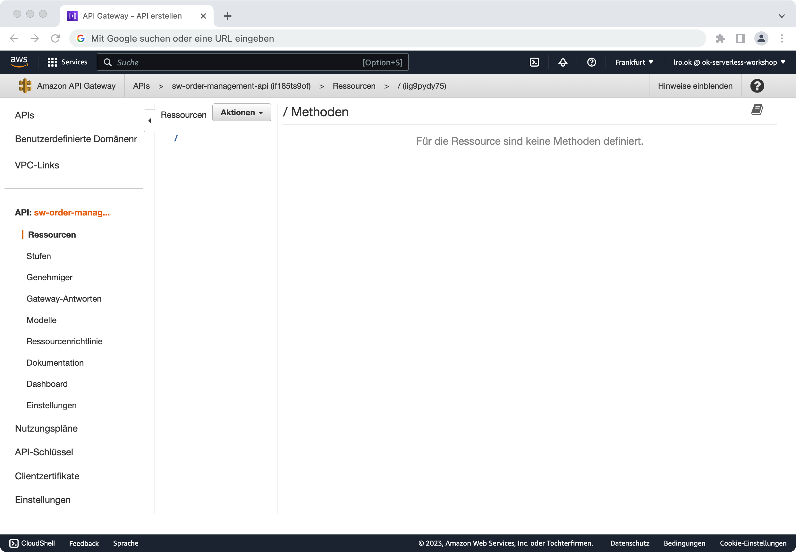
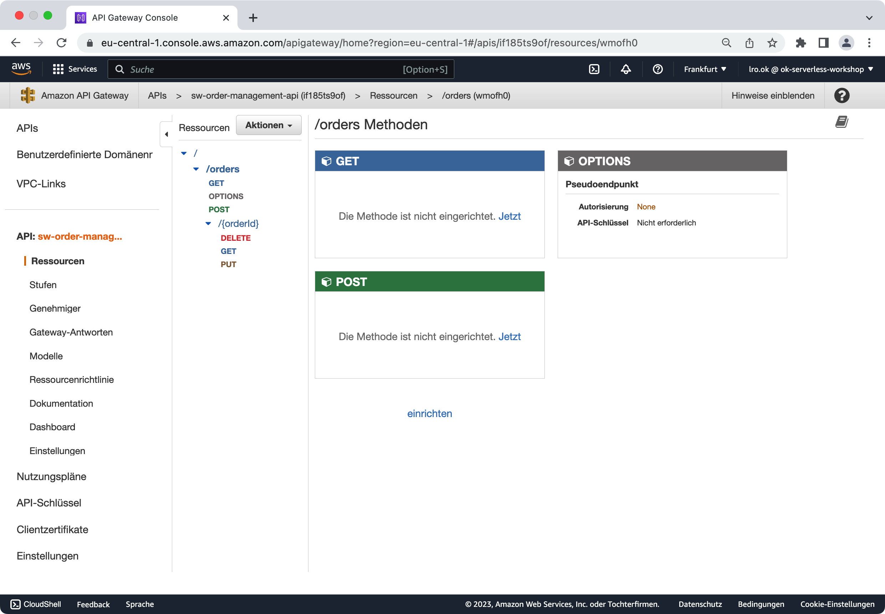
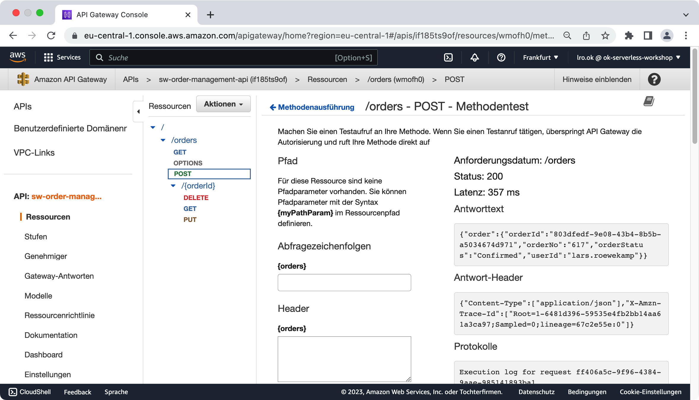
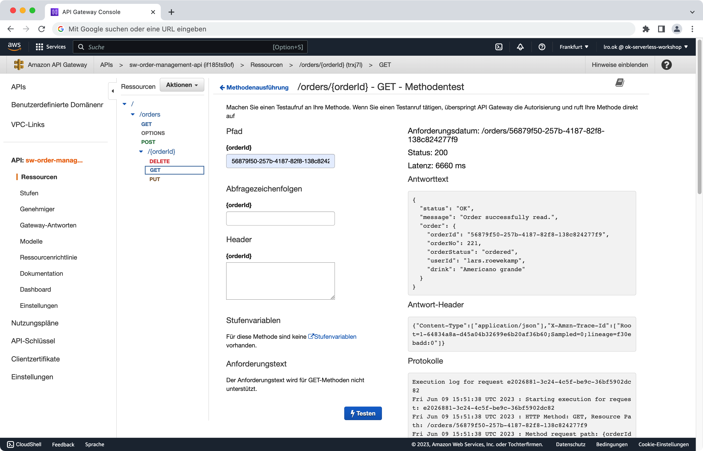
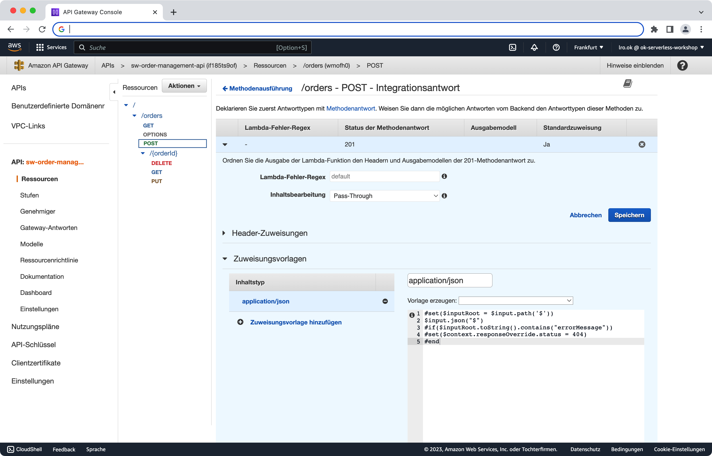
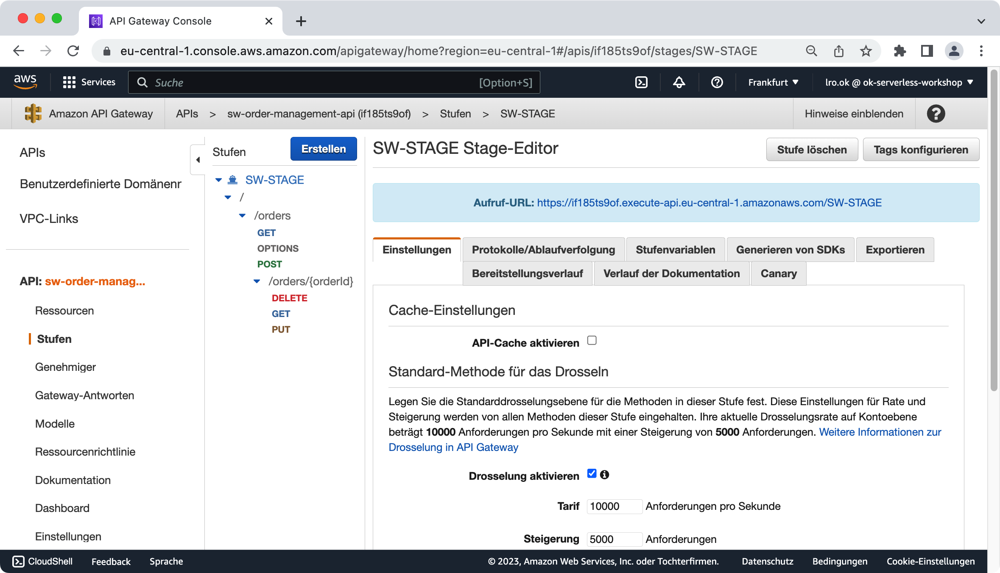
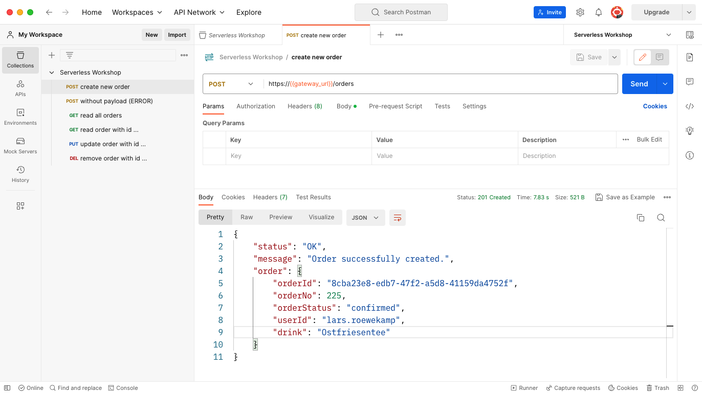

# Serverless Workshop

## Übung 4: API Gateway

Bisher ist alles was wir erstellt und implementiert haben nur innerhalb unseres AWS Cloud-Accounts zugreifbar. Mit dieser Übung möchten wir nun auch den Zugriff von aussen ermöglichen. Das Mittel zum Zweck ist ein [AWS API Gateway] (https://docs.aws.amazon.com/de_de/apigateway/latest/developerguide/welcome.html). 

Ziel dieser Übung ist es, ...
> die Funktionalität des Order Managements via REST-API für externe Clients (z.B. Mobile oder Web Apps) zur Verfügung zu stellen. 

### Schritt 1: API Gateway anlegen 

Im ersten Schritt legen wir zunächst einmal ein leeres API Gateway an und machen uns mit den grundlegenen Konfigurationsmöglichkeiten vertraut. 

Zu diesem Zweck rufen wir den AWS Service _API Gateway_ auf und klicken dort auf 

* API erstellen

Da wir eine RESTful-API erstellen wollen, wählen wir auf der im Anschluss erscheinenden Seit die Option 

* REST API > Erstellen 

aus und geben im Anschluss einen Namen unserer Wahl ein: 

* sw-order-management-api 

Alle anderen Einstellungen übernehmen wir wie vorgeblendet. Das Ergebnis ist - wenig überraschend - ein "leeres" API-Gateway (Abbildung 01).


Abbildung 01: *OMS API Gateway*


### Schritt 2: Ressourcen & Methoden anlegen 

Wir möchten mit unserer RESTful API Ressourcen vom Typ _Order_ anlegen, ändern, löschen und natürlich auch abfragen können. Unsere API benötigt also eine entsprechende Ressource: 

* Aktionen > Ressource erstelle
* Ressorucenname: Orders
* Ressourcenpfad: oders
* API Gateway CORS aktivieren: yes

Im Anschluss auf _Ressource erstellen_ klicken und fertig ist die Basis unserer API. 

Da wir CORS aktiviert haben, wird automatisch die http-Methode _OPTIONS_ zur Verfügung gestellt. Diese können wir nuzten, um einen ersten Test durchzuführen und uns so ein wenig mit der Oberfläche vertraut zu machen. Nehmt euch also ein wenig Zeit und klickt euch durch die AWS Gateway UI für die http-Methode _OPTIONS_ 

Natürlich benötigen wir neben _OPTIONS_ noch weitere http-Methoden, um unser oben beschriebenes Ziel zu erreichen. Aber welche sind das genau? 

Zum Anlegen einer Order benötiegen wir 

	POST /orders
	
Zum Abfragen ALLER Orders (bzw. einer gefilterten Liste von Orders) nutzen wir

	GET /orders (plus optionale Filter)


Möchten wir eine spezifische Order abfragen, ändern oder löschen, geschieht dies über 

	GET /orders/{orderId}
	PUT /orders/{orderId}
	DELETE /orders/{orderId}

Die ersten beiden Fälle sind auf Basis des aktuellen Standes schnell angelegt: 

* Aktionen > Methode erstellen: GET > bestätigen
* Aktionen > Methode erstellen: POST > bestätigen

Wie aber sieht es mit den Fällen aus, in denen ich gezielt die _orderId_ mit angeben möchte? 

Aus Sicht der API stellt der Ausdruck 

	/orders/{orderId}

eine zweite Ressource bzw eine Sub-Ressource von der bereits existierenden Ressource 

	/orders 
	
dar. Entsprechend müssen wir also zunächst diese Ressource anlegen, bevor wir mit den weiteren Methoden (auf dieser Ressource) fortfahren können: 

> **Achtung**: Vor den folgenden Schritten, zunächste die Ressource /orders markieren, damit die neue Ressource als Sub-Ressource von der bereits bestehenden /orders Ressource angelegt wird!

* Aktionen > Ressource erstellen
* Ressorucenname: {orderId}
* Ressourcenpfad: oders/{orderId}

Im Anschlus können wir die drei fehlenden Methoden für unsere neue Ressource _/orders/{orderId}_ anlegen: 

* Aktionen > Methode erstellen: GET > bestätigen
* Aktionen > Methode erstellen: PUT > bestätigen
* Aktionen > Methode erstellen: DELETE > bestätigen

Das Resultat unser bisherigen Bemühungen sollte ein wie in Abbildung 02 dargestellter Ressourcen-/Methoden-Baum sein. 


Abbildung 02: *OMS API Gateway mit Ressourcen und Methoden*


Die Schnittestelle unsere Restful API wäre somit fertig. Allerdings würde ein Aufruf einer der möglichen Methoden noch keine Aktion im Backend auslösen. Genau diese Herausforderung wollen wir in nächsten Schritt angehen.

### Schritt 3: Verbindung zum Backend 

Um die einzelnen Methoden mit Funktionalität zu versehen, müssen wir eine Verbindung zum Backend herstellen. Dies passiert auf Ebene der einzelen http-Methoden. 

Für das Anlegen einer neuen Order zum Beispiel, gilt es die http-Methode 

	POST /orders
	
mit der zugehörigen Serverless Function 

	sw-oms-create-order 
	
zu verbinden: 

* POST Methode der Ressource /orders anklicken
* Integrationstyp: Lambda-Funktion
* Lambda-Region: [MY REGION]
* Lambda-Funktion: sw-oms-create-order 
* "Speichern" klicken

Durch diesen Eintrag erlauben wir dem API Gateway, auf unsere Lambda-Funktion zuzugreifen. Dies gilt es ggf in einem PopUp zu bestätigen. 

Im Anschluss, können wir die Verbindung testen. Anders als zuvor beim Test der http-Methode _OPTIONS_ müssen wir beim Testen der Integration via _POST_ eine Payload - also die anzulegende Bestellung - mitgeben. Dazu tragen wir im Feld _Anforderungstext_ unsere JSON-Payload ein und klicken auf _Testen_: 

```
{
    "userId":"lars.roewekamp", 
    "drinke":"Americano grande"
}
```

Das Resultat unseres Calls sollte in etwa wie in Abbildung 03 aussehen. 


Abbildung 03: *OMS API Gateway mit Backend-Integration*

Genau so wie für die Methode 

	POST /orders
	
können wir nun auch mit  

	GET /orders
	
zum Abfragen aller gespeicherten Bestellungen vorgehen. 

	
	
Bei den drei übrigen Calls für eine dedizierte Order-Ressource, also diejenigen URLs mit _orderId_ im Pfad

	GET /orders/{orderId}
	PUT /order/{orderId}
	DELETE /order/{orderId}

muss für den Test noch zusätzlich der Wert für Pfad-Parameter _orderId_ im dafür automatisch generierten Eingebefeld angegeben werden:

* Pfad > {oderId}

Im folgenden sind noch einmal exemplarischen Test-Payloads für die verschiedenen Calls aufgeführt:  

Test-Payload für **oms-read-order**: 

Lesen einer einzelnen Bestellung (via orderId):

```
{                    
	"orderId" : "MY_ORDER_ID"
}
```

Lesen aller Bestellungen, die einem bestimmten Filterkriterium entsprechen (via filter und filter-attributes): 

```
{                    
	"filter" : "MY_FILTER", 
	"filter-attributes": [
	    "filter 1", 
		"filter 2" 
	]
}
```

Test-Payload für **oms-update-order**: 

```
{                    
	"orderId" : "MY_ORDER_ID"
	"drink" : "Americano grande with EXTRA MILK"
}
```


Test-Payload für **oms-delete-order**: 

```
{                    
	"orderId" : "MY_ORDER_ID"
}
```

### Schritt 4: Request Parameter- und Payload-Mapping

Theoretisch ist unsere API nun vollständig mit dem Backend integegriert und könnte somit bereitgestellt werden. Unschön ist allerdings, dass wir bei den drei Calls für dedizierte Ressourcen mit der _orderId_ redundante Informationen in der Payload und im Pfad weitergeben. Dies gilt insbesondere für die http-Methoden _GET_ und _DELETE_, die normalerweise gänzlich ohne Payload auskommen würden. 

Wir werden daher in diesem Schritt für die beiden genannten Methoden ein automatische Mapping erstellen, welches den Pfadparameter _oderId_ ausliest und damit die Payload anreichert: 

* GET /orders/{orderId} auswählen
* Integrationsanforderung (Request) anklicken
* Zuweisungsvorlagen auswählen
* Zuweisungsvorlage hinzufügen
* Inhaltstyp: application/json

In das unter _Inhaltsytp_ stehende Eingabefenster folgendes Mapping eintragen und im Anschluss _Speichern_ klicken: 

```
#set($inputRoot = $input.path('$'))
{ 
  "orderId" : "$input.params('orderId')"
}
```

Wenn wir jetzt die beiden Methoden erneut testen, können wir die Payload leer lassen. In der Ausgabe finden wir im Anschluss u.a. die folgenden Informationen zu der erfolten automatioschen Transformation: 

```
HTTP Method: DELETE, Resource Path: /orders/12334332
Method request path: {orderId=MY_ORDER_ID}
...
Endpoint request body after transformations: { 
   "orderId" : "12334332"
}
```

Abbdilung 04 zeigt einen erfolgreichen Test-Call für die http-Methode _GET_ auf einer dedizierten Ressource:


Abbildung 04: *GET /orders/{orderId} mit automatischem Mapping*

Und auch für die http-Methoden _PUT_ können wir ein entsprechendes Mapping vornehmen und uns so die _orderId_ in der Payload sparen. 

```
#set( $input.path('$').orderId = $input.params('orderId'))
$input.json('$')
```

### Schritt 5: Response Status Code Mapping

Im aktuellen Zustand liefert unser API Gateway grundsätzlich einen HTTP-Status Code 200 (OK) zurück. Dies gilt auch dann, wenn auf Seiten des Backends, also innerhalb unserr Serverless Functions, ein Fehler aufgetreten ist. Hier gilt es Abhilfe zu schaffen. 

Zum einen wollen wir Fehler auch als solche darstellen, z.B. durch 

* 400 BAD REQUEST 
* 500 SERVER ERROR 

Zum anderen wollen wir aber auch die positiven Fälle mit spezifischen Status Codes beantworten:

* 200 OK
* 201 CREATED
* 202 ACCEPTED
* 204 NO CONTENT

#### Status Code 2xx setzen

Starten wir mit der http-Methode _POST_. Ist das Anlegen einer Bestellung erfolgreich, sollte die Methode kein 

* 200 OK 

zurückgeben, sondern den spezifischeren Status Code

* 201 CREATED

> *Anmerkung*: Aus fachlicher Sicht könnte man an dieser Stelle auch überlegen, einen Status Code 202 ACCEPED zurückzugeben, da die Order zwar angenommen (confirmed) aber noch nicht ausgeführt (ready for pick-up) ist. 

Um den Status Code 201 als Rückgabewert für eine erfolgreiche Bestellaufgabe zu setzen, müssen wir zunächst diesen Code für die Methode _POST_ als mögliche Option angeben: 

* POST Methode selektieren
* Antwort hinzufügen 
* HTTP Status Code eingeben > 201 
* Speichern 

Weil wir gerade schon dabei sind, können wir auch gleich die beiden Codes 

* 400 BAD REQUEST
* 422 UNPROCESSABLE ENTITY
* 500 INTERNAL SERVER ERROR

hinzufügen. Da es sich bei diesen beiden Antworttypen um Fehlermeldungen handelt, sollten wir zusätzlich bei dem Antworttext die folgenden Angaben machen: 

* Antwortmodell hinzufügen
* Inhaltstyp > apllication/json
* Modelle > Error 

Aber zurück zu unserem Status Code 201. Diesen gilt es nun als Default für eine erfolgreiche Bestellung zu setzen: 

* POST Methode selektieren
* Integrationsantwort auswählen
* Default Integrationsantwort 200 löschen 
* Integrationsantwort hinzufügen
* Status der Methodenantwort > 201 auswählen

Der Status 201 wird so automatisch zur neuen Standardantwort. 

#### Status Code 4xx / 5xx setzen

Schauen wir uns nun den Fehlerfall an. Was passiert zum Beispiel, wenn wir eine Bestellung aufegeben, aber in der Payload vergessen, das zu bestellende Geträng anzugeben? 

Die Lambda-Funktion wifrt in diesem Fall eine IllegalArgumumentException inkl. des Fehlertextes 

* "Missing attributes (userId and/or drink)"

Dei Serverless Function wrappt das ganze in einer LambdaException welche für den folgenden Output sorgt: 

```
{
	"errorMessage" : "ERROR: Missing attributes (userId and/or drink)",
	"errorType : "java.lang.IllegalArgumentException",
	"stackTrace" :[
	    "de.openknowledge.workshop.serverless. ..."
	]
}
```

Dies machen wir uns für die Zuweisung des Fehler-Codes zu nutzen: 

* POST Methode auswählen
* Integrationsantwort klicken 
* Integrationsantwort hinzufügen
	* Lambda-Fehler RegEx setzen > .\*Missing.\*
	* Status der Methoden-Antwort > 422 
* Speichern 

In obigen Beispiel reagieren wir konkret auf den Fall, das eines der JSON-Argumente nicht angegegen wurde. Alternativ kann als RegEx natürlich auch einfach 

* .\*ERROR.\* 

verwendet werden, wodurch die Regel für alle Fehler gelten würde. Dies gilt zumindest dann, wenn wir dafür sorgen, dass beim Erzeugen der Fehlermeldung grundsätzlich das Wort _ERROR_ vorangestellt wird. Das Problem ist nämlich, dass die Lambda-Fehler RegEx nicht in der gesamten Payload nach dem passenden Begriff sucht, sondern lediglich in dem Wert des JSON-Elements _errorMessage_. 

Eine Alternative Möglichkeit bietet sich, durch das gezielte Umleiten der Default-Behandlung (in unserem Fall 201): 


* POST Methode auswählen
* Integrationsantwort klicken 
* 201 auswählen und ausklappen
* Zuweisungsvorlagen wählen 
	* Zuweisungsvorlage hinzufügen >application/json
	* Template eingeben (siehe Code-Snippet direkt im Anschluss)
	* Speichen nicht vergessen! 

Das folgende Template schaut in der **gesamten** Payload nach dem Begriff _errorMessage_ und überschreibt beim Auffinden den Status-Code mit 400. Da _errorMessage_ eines der JSON-Elemente der LambdaException ist, wird das Template im Falle eines Fehler immer gefunden: 

```		
#set($inputRoot = $input.path('$'))
$input.json("$")
#if($inputRoot.toString().contains("errorMessage"))
#set($context.responseOverride.status = 400)
#end
```
Abbildung 05 zeigt das Ergebnis der eben beschriebenen Schritte. 


Abbildung 05: *GET /orders/{orderId} mit automatischen Mapping*


Es git übrigens, dass zunächst die spezielleren Lambda-Fehler RegEx greifen, bevor am Ende die Default-Variante gewählt wird. In unserem Fall heist das, dass wir für fehlende Attribute weiterhin, wie gewünscht, den Status Code 422 bekommen und alle anderen Fehler mit einem 400 beantwortet werden. 

#### Aufgaben

Im folgenden sollst du einige Mappings nach dem oben beschriebenen Schema vornehmen. Welche Variablen dir dabei für den gezielten Zugriff auf den Server-Response, die Payload etc. zur Verfüng stehen, findest du unter 
[Setting up data transformations for REST APIs](https://docs.aws.amazon.com/apigateway/latest/developerguide/rest-api-data-transformations.html)


**Aufgabe 1:**

Sorge dafür, dass auch bei den Methoden 

* PUT 
* DELETE 

der Status-Code 422 zurückgeben wird, wenn eines der erwarteten Attribute fehlt. Theoretisch kann dies nicht der Fall sein, da das einzige Pflichtattribut bei beiden Methoden _orderId_ ist und wir diese bereits in der vorherigen Übung durch automatisches Mapping aus dem URL-Pfad in die Payload gepackt haben - aber man weiß ja nie ;-) 

**Aufgabe 2:**

Für den Fall, dass 

* GET /orders 

eine leere Liste zurück liefert, soll der Status Code 204 NO CONTENT gestezt werden. 

**Aufgabe 3:**

Für den Fall, dass 

* GET /order/{orderId} 

kein Resultat zurück liefert, soll der Status Code 404 NOT FOUND gestezt werden.

	
### Schritt 6: Bereitstellung des API Gateways

Unsere API ist aus technischer Sicht nun fertig. Allerdings kann sie nach wie vor nicht von aussen - z.B. via Mobile- oder Web-App - aufgerufen werden. Es fehlt noch die Bereitsstellung als Stage. Aber auch das ist kein Hexenwerk: 

* Aktion > Bereitstsellen der API
* Bereitstellungsstufe: [NEUE STUFE]
	* Stufenname: SW-STAGE
	* Beschreibung der Stufe: Serverless Workshop Stage
	* Beschreibung der Bereitstellung: v0.1

> *Hinweis*: Eine Bereitsstellung als STAGE ist erst dann möglich, wenn allen Ressourcen / Methoden entsprechende Integrationen (Serverless Functiosn) zugeordnet wurden. Um Fehlermeldungen zu umgehen, kann die Integration vorrübergehend als MOCK angegeben werden. 

Abbildung 04 zeigt die bereitgestellte Stage inkl. der von Aussen aufrufbaren URL. 


Abbildung 04: *OMS API Gateway STAGE*

> **Tipp**: über das Tab _Exportieren_ kann unsere API im Swagger- oder OpenAPI-Format exportiert werden. Entsprechend Exporte liegen im Verzeichnis /04\_api\_gateway/export. 

### Schritt 7: End-to-End Testing

Bleibt uns nur noch, unsere Order Management API von aussen zu testen. Dies kann z.B. via POSTMAN oder ein beliebiges anderes Tool zum Absetzen von HTTP-Request geschehen. Abbildung 05 zeigt eine erfolgreiche Bestellung.



Abbildung 05: *Erfolgereiche Bestellung via API Gateway*

> **POSTMAN**: Für Freunde von POSTMAN liegt eine entsprechende API-Call Collection im Verzeichnis /04\_api\_gateway/postman bereit. 
 


### Diskutierenswert ... 

Frage an dich selbst: 
> Wie können über unser API Gateway Umgebungen wie DEVELOPMENT, TESTING und PRODUCTION voneinander getrennt werden? 

Frage an dich selbst: 
> Wie lassen sich Security Attacken, wie z.B. DDoS- und DoS-Angriffe, vermeiden?


